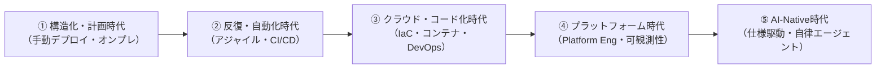
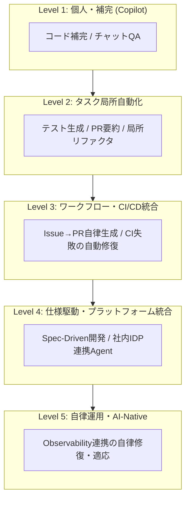

# ソフトウェア開発の歴史的潮流と生成AI活用の5段階成熟度モデル

## 1. ソフトウェア開発の歴史的変遷と普遍的進化則

ソフトウェア工学の歴史は、一貫して「プロセスの宣言的コード化と自動化」「フィードバックサイクルの極小化」「抽象度の向上」を追求してきた軌跡である。
生成AIやAIエージェントの組織的活用は過去の潮流から断絶した特異点ではなく、これまでの工学的進化の直接の延長線上に位置づけられる。



| 時代区分 | 変革（パラダイム） | 代表的な技術・手法 | 解決した課題（前時代のPain） | もたらされた本質的価値 | その時代が直面した新たな限界（次への動機） |
| :--- | :--- | :--- | :--- | :--- | :--- |
| **① 構造化・計画時代** | 体系的工程管理への転換、計画重視のソフトウェア工学 | ウォーターフォールモデル、手動運用、オンプレミス | 属人的開発による工数爆発・品質破綻（ソフトウェア危機）、進捗管理の不透明さ | プロジェクト計画の再現性確立、大規模開発の組織的統制 | **変化への適応不能** 要求変更への脆弱性、ビッグバンリリースの高リスクと手戻り、フィードバックの遅延 |
| **② 反復・自動化時代** | 反復・漸進的開発への転換、継続的インテグレーション | アジャイル/スクラム、**CI/CD・テスト自動化（TDD）**、分散VCS（Git） | ビッグバンリリースの高リスクと手戻り、手動テストの限界による品質低下、フィードバック遅延 | **フィードバックサイクルの短縮、品質のシフトレフト** | **環境の属人化・物理制約** 物理ハード調達の長期リードタイム、環境差異（"It works on my machine"）、手動インフラ設定のドリフト |
| **③ クラウド・コード化時代** | 開発と運用の統合（DevOps）、インフラ・運用のコード化 | パブリッククラウド、コンテナ（Docker/K8s）、**IaC・宣言的インフラ (Terraform)** | 物理調達の長期リードタイム、環境差異、インフラ設定の手作業・属人化（構成ドリフト） | **インフラ・構成・運用プロセスの「コード化と再現性」** | **認知負荷の爆発** ツールやマイクロサービスの乱立による開発者の認知負荷爆発、分散運用の複雑化とガバナンス喪失 |
| **④ プラットフォーム時代** | 開発者体験（DevEx）の重視、内部基盤によるセルフサービス化 | **Platform Engineering (IDP)**、**疎結合・モジュール設計（API契約標準化）**、GitOps、**可観測性（Observability）** | ツール乱立による認知負荷爆発、分散運用の複雑化とガバナンス喪失 | **内部開発基盤によるセルフサービス化、疎結合なサービス境界とAPI契約の確立** | **人間の実装限界** 人間のコード記述・読解速度の物理的限界、自然言語仕様とコード実装の認知的乖離 |
| **⑤ AI-Native時代** | 仕様・評価基準駆動への転換、人間と自律エージェントの協調 | 生成AI / AIエージェント、Spec-Driven開発（SDD）、MCP、Evaluation Harness | コード記述・実装の認知的ボトルネック、自然言語仕様と実装の乖離、生成コードの検証・レビュー負荷 | **「仕様定義と評価関数の設計」への抽象化、自律的デリバリサイクルの実現** | **自律性の暴走・品質保証** 自律エージェントの誤動作・非決定論的出力の品質保証、アーキテクチャ統制とガバナンス |

### 歴史的潮流に通底する3つの進化則

過去のパラダイムシフトを俯瞰すると、以下の3つの共通原理が働いている。

1. **プロセスの宣言的コード化と自動化（手動作業のCode/Config化）**：インフラ、ビルド、デプロイ、セキュリティポリシーをコードとして記述し、機械可読かつ再現可能な状態へ置き換えてきた。
2. **フィードバックサイクルの極小化（高速化と自動検証）**：静的解析、単体テスト、統合テスト、デプロイ検証をパイプライン化し、異常の検知から修正・反映までの時間を数か月から数分へと縮退させた。
3. **抽象度の向上（開発者の関心事の高次化）**：物理ハードウェアの管理からOS・ミドルウェアの制御へ、さらにアプリケーションコードの実装からドメイン仕様・評価基準の定義へと、人間の主たる関心事が高次レイヤーへ引き上げられてきた。

---

## 2. 開発組織における生成AI活用の5段階成熟度モデル

生成AIの組織的活用は、単一ツールの導入にとどまらず、開発プロセスおよび組織アーキテクチャの再設計を伴う段階的移行となる。

なお、本成熟度モデルは**「上位レベルに到達すると下位レベルが不要になる（置き換わる）」という排他的なフェーズ移行ではない**。
上位レベルは下位レベルの工学的基盤を土台として内包する**累積的・階層的な構造**を持つ。
例えば、組織全体としてLevel 4（仕様駆動開発やIDP連携）を確立している環境であっても、日々の開発の各所ではLevel 1（インライン補完やチャットQA）、Level 2（手元での局所リファクタ）、Level 3（CI自己修復やPR起票）が適材適所で同時に稼働・共存する。



### Level 1：個人アシスタント・補完（Copilot時代）
- **概要**：開発者個人の統合開発環境（IDE）上でインライン補完やチャットによる質疑応答を行う段階。
- **主たる用途**：ボイラープレートコードの記述補助、関数レベルのコード生成、構文やAPIの検索。
- **組織の制約・ボトルネック**：個人の入力速度は向上するものの、後続のレビューやテスト工程がボトルネックとなり、開発組織全体のスループット向上は限定的にとどまる。

### Level 2：タスク駆動・局所対話型（Interactive Local Task）
- **概要**：開発者が手元環境（IDE/CLI）でAIと対話しながら、単発の特定作業を同期的に委譲・実行する段階。
- **主たる用途**：
  - 単一関数やモジュールに対するテストコード生成
  - 局所的なリファクタリングやライブラリ更新のコード生成
  - PR説明文の作成や静的解析エラーの個別解説
- **組織の制約・ボトルネック**：
  - **同期的な手動操作への依存**：個別の手作業は効率化されるが、「人間がプロンプトを入力し、画面の前で出力を待って目視確認する」同期的な手動操作に縛られており、開発リードタイムは人間の稼働時間に制約される。
  - **プロジェクト情報のコンテキスト整備不足**：設計方針、コーディング規約、ドメイン知識などのプロジェクト情報が機械可読なコンテキスト（ルールファイルや構造化ドキュメント等）として整備されていない場合、AIが的外れな出力を返しやすく、人間が都度前提を手動で説明・補正する負荷が増大する。エージェントが的確に動くための「入力コンテキストの整備」が前提となる。

### Level 3：イベント駆動・ワークフロー統合型（Asynchronous Workflow & CI-Integrated）
- **概要**：人間が手動指示するのではなく、VCSやCI/CDのイベント（Issue起票やCI失敗）を起点に、エージェントがバックグラウンドで一連の開発工程（調査〜実装〜自己検証〜PR作成）を非同期に自律完結させる段階。
- **主たる用途**：
  - **Issue起点の一気通貫PR作成**：バグ報告Issueをトリガーに、エージェントがコードベース走査・修正・テスト追記・CI検証を経てPRを自律起票する。
  - **CI失敗時の自己修復ループ（Auto-Fix）**：テスト失敗ログをエージェントが自律解析し、修正コミットを再プッシュしてCIを通過させる。
  - **非同期マルチエージェント分業**：調査・実装・レビュー担当のエージェントが裏側で協調してワークフローを回す。
- **組織の前提条件・ボトルネック**：**強固なCI/CD基盤とテスト自動化が不可欠となる**。エージェントが自己修復ループを回すための「機械可読なフィードバック（CIの成否）」が存在しない環境では機能しない。

### Level 4：仕様駆動・Platform Engineering統合（Spec-Driven & Platform Orchestration）
- **概要**：人間の主たる業務が個別コードの記述（How）から「仕様、インターフェース契約、評価基準・アーキテクチャ制約の定義（What / Why）」へ完全に移行する段階。
- **主たる要素・用途**：
  - **仕様駆動開発（Spec-Driven Development: SDD）**：
    - **正本（Source of Truth）の逆転**：実装コードではなく、形式化された仕様（構造化された要求、APIスキーマ、型定義、事前・事後条件、受け入れ基準・テストハーネス）を唯一の正本として位置づける。
    - **仕様からの自律的導出と同期**：エージェントが仕様を解釈し、契約に適合する実装コード、データストア定義、テストスイート、クライアントSDKを一貫して生成・検証する。要求変更時はコードの手動修正ではなく、仕様の更新を起点として実装が自律的に再導出・再同期される。
  - **社内開発プラットフォーム（IDP）連携**：エージェントが社内API、サンドボックス環境、インフラ（IaC/Kubernetes）を安全なプロトコル（MCP等）経由で操作し、環境構築からデプロイまでを安全なガードレール内で完結させる。
- **組織の前提条件・ボトルネック**：
  - **③・④の工学的基盤が不可欠**：エージェントのコンテキスト溢れを防ぎ自律性を担保するには、④プラットフォーム時代に培われた「疎結合なモジュール/サービス境界」と「機械可読なAPI契約（OpenAPI等）」によるコンテキストの局所化が前提となる。
  - **安全な実行基盤とガバナンス**：エージェントに環境構築やデプロイを委譲するための社内IDP（Internal Developer Platform）および権限分離・ガバナンスポリシーが未整備な場合、エージェントの破壊的変更を防げず組織導入が頓挫する。

### Level 5：自律運用・AI-Native組織（Self-Healing & Continuous Adaptation）
- **概要**：本番環境のテレメトリ（メトリクス、ログ、分散トレース）とエージェントが常時接続し、システムの保守・改善が自律的に循環する段階。
- **主たる用途**：
  - **自律修復（Self-Healing）**：本番環境の異常や性能劣化を検知したエージェントが、原因特定から修正PR作成、ステージング検証、カナリアリリースまでを自動進行する。
  - **自律的仮説検証**：利用ログを分析したエージェントが機能改善のA/Bテストコードを起票・デプロイし、結果を計測して本採用の可否を判断する。
- **組織の前提条件・ボトルネック**：高度な可観測性基盤（分散トレーシング、リアルタイムメトリクス）、自動ロールバック機構、および自律エージェントの振る舞いに対する強固なセキュリティ・ガバナンス統制が必須となる。

---

## 3. 工学的基盤とAI活用の構造的相関

生成AIの活用ステージを引き上げるための前提条件は、過去20年にわたり培われてきたソフトウェア工学のベストプラクティスと1対1で対応している。

```
【② CI/CD・テスト自動化】     ──▶  AI生成コードに対する「自動評価器（Evaluator）」として機能する
【③ IaC・宣言的インフラ】     ──▶  AIエージェントが安全に操作できる「APIインターフェース」を提供する
【④ 疎結合・モジュール設計】  ──▶  AIの「コンテキストウィンドウ・認知負荷の限界」を突破する境界線となる
【④ 可観測性（Observability）】──▶  AIが本番の挙動を理解し「自律改善ループ」を回すための入力となる
```

### なぜCI/CDと自動テストが不可欠なのか
AIによってコードの「生成速度」が桁違いに加速しても、人間の「読解速度」は変わらない。
静的解析、型チェック、単体テスト、結合テスト、プレビュー環境デプロイがパイプラインとして整備されていない組織では、生成された大量のコードの安全性を検証できず、レビュー負荷の爆発によってデリバリ全体が律速される。
加えて、エージェントが試行錯誤しながらコードを自己修正する際、**CIのエラーログこそがエージェントに対する確定的な報酬信号（Reward Signal）**として機能する。
自動化された検証機構の存在が、エージェントの自律性を成立させる前提となる。

### なぜPlatform Engineeringが不可欠なのか
エージェントに社内リソースや本番環境を操作させる際、無制限の権限を与えればセキュリティ事故や構成破壊を招く。
権限分離、サンドボックス実行環境、ポリシー検査、標準化されたAPIインターフェースを備えた社内プラットフォーム（IDP）が存在して初めて、エージェントは安全なガードレールの中で自律的なオーケストレーションを実行できる。

---

## 4. このモデルを支える先行研究/調査と理論

本成熟度モデルと工学的基盤の関係性は、近年の定量調査およびソフトウェア工学の第一線で実証されている。

### ① Google Cloud DORA Research（2023〜2025年版）
- **AIは組織状態の増幅器（AI as an Amplifier）**：CI/CDや疎結合アーキテクチャが確立した高パフォーマンス組織ではAIが生産性を大きく伸長させる一方、基盤の未熟な組織にAIを導入すると低品質なコードが滞留し、デリバリの安定性が低下することを実証した。
- **導入のJカーブ効果（J-Curve of Adoption）**：導入初期はプロンプトの調整やワークフロー摩擦により一時的に生産性指標が停滞し、自動テストや内部基盤を再整備することで急激に効果がスケールする段階的特性を報告している。

### ② CMU SEI & Accenture：AI Adoption Maturity Model (v1.0)
カーネギーメロン大学ソフトウェア工学研究所（SEI）とアクセンチュアによるフレームワーク。
AI導入の成熟度を「Ad-hoc（個別試行）」「Defined/Operational（プロセス統合）」「Reflexive/Optimized（自律統合）」のフェーズに分類し、単なるツール配備ではなく**SDLCへの統合深度、ガバナンス、自動評価インフラ**こそが成熟度向上の決定要因であると定式化している。

### ③ Andrej Karpathy：Software 2.0からSoftware 3.0へのシフト
- **Software 1.0**：人間が明示的な命令（ロジック）をコードとして書く。
- **Software 2.0**：人間がデータと損失関数を与え、ニューラルネットワークが重みを最適化する。
- **Software 3.0**：人間が自然言語や仕様（プロンプト・コンテキスト）で要求を記述し、基盤モデルとエージェントがプログラムを構成・実行する。
このモデルは、人間の役割が「コードの記述」から「仕様定義と評価関数の設計」へと抽象化するLevel 4の理論的根拠となっている。

### ④ Martin Fowler & Thoughtworks / Kent Beck
- **ボトルネックの所在**：Martin Fowlerらは、ソフトウェア開発の本質的難所はコードの入力ではなく「何を構築すべきかの理解、設計、検証」にあると指摘し、AI時代こそアジャイルの規律（TDD、小さなバッチサイズ、頻繁な統合）が重要になると論じている。
- **TDDの価値再評価**：Kent Beckは、AIがコード生成を担う環境において「何が正しい振る舞いかを機械可読なテストとして先行定義するTDDの役割」が最大化すると主張している。

### ⑤ SWE-bench（ICLR 2024）
実世界のオープンソースIssueをAIエージェントが自律解決できるかを検証するベンチマーク。
エージェントがバグ修正を完遂するためには、広範なコードベースのコンテキスト収集に加え、**テストスイートの実行とフィードバックに基づく自己修正ループ**が不可欠であることが示されている。

---

## 5. 組織が段階を進めるための実践ロードマップ

組織におけるAI活用レベルを向上させるためのロードマップを以下に示す。

### 1. 基盤整備期（Level 1 → Level 2）
- **プロジェクト情報のコンテキスト整備**：設計方針、アーキテクチャ規約、ドメイン知識をAI Friendlyな形式で構造化ドキュメントとして整理し、エージェントが文脈を正確に把握できる土台を作る。（`AGENTS.md` / `CLAUDE.md` 等の整備も含む）
- **テスト自動化の推進**：AIを活用して既存コードの単体テストを整備し、テストカバレッジのベースラインを引き上げる。
- **CIパイプラインの高速化**：フィードバックが数分以内に返るようにパイプラインを最適化・並列化する。
- **設計ルールと制約の明文化**：Linter、フォーマッタ、型定義を厳格化し、機械可読な制約を揃える。

### 2. プロセス再設計期（Level 2 → Level 3）
- **VCSイベントへのエージェント統合**：GitHub Actions等と連携し、Issue起票を起点としたPR自律作成やCI失敗時の自己修復（Auto-Fix）ループを定常化する。
- **レビュー構造の転換**：人間の主たる役割を「コードの全行確認」から「仕様妥当性の判断とCI検証結果・ハーネス評価の承認」へ移行させる。

### 3. アーキテクチャ適応期（Level 3 → Level 4）
- **仕様駆動開発（SDD）の確立**：要求定義、APIスキーマ、型定義、評価基準（テストハーネス）を正本（Source of Truth）とし、エージェントが実装・テスト・SDKを一貫して自律導出・同期するワークフローを導入する。
- **疎結合なモジュール境界の徹底**：OpenAPI、GraphQL、Protocol Buffers等で明確なインターフェース契約を定義し、エージェントのコンテキストウィンドウに収まる境界を確立する。
- **実行基盤の安全化（IDP連携）**：エージェントが安全に利用できるサンドボックス環境とツール連携プロトコル（MCP等）を社内プラットフォーム（IDP）へ組み込み、ガードレール付きの自律実行基盤を提供する。

### 4. 自律運用・AI-Native期（Level 4 → Level 5）
- **可観測性（Observability）と修復ループの統合**：本番環境の分散トレース・メトリクス・ログとエージェントを常時接続し、異常検知から修正PR起票・カナリア検証までの自律修復（Self-Healing）を構築する。
- **自律的仮説検証サイクルの導入**：利用ログや行動データの分析に基づき、改善施策のA/Bテストコード起票から効果計測・本採用判定までを自律サイクル化する。
- **ガバナンスと安全制御の高度化**：エージェントの非決定論的出力や予期せぬ動作を防ぐ多層防御、自動ロールバック機構、ポリシー検査を徹底する。

### 5. 評価メトリクスの再定義
- コード生成行数やコミット数といった活動量指標のみに依存することを避け、**Four Keys（デプロイ頻度、変更リードタイム、変更失敗率、MTTR）**および手戻り率を主評価指標として定常観測する。
- ツールの定着度（入力）をモニタリングしつつも、組織の評価軸を「局所的なコード記述速度」から「エンドツーエンドの価値提供リードタイム短縮とシステムの安定性（アウトカム）」へシフトさせる。

---

## 関連リンク

- [[engineering-and-core-skills|生成AI時代におけるエンジニアの在り方と5つのコアスキル (Delivery Reinvention)]]
- [[ai-coding-verification-and-harness|AIコーディングにおける検証構造とハーネスアーキテクチャ (Verification & Harness)]]
- [[digital-it-transformation|AIを活用したデジタル・ITの自社取り戻しと企業変革 (AI Transform)]]
- [[../ch_Arch/ai_assisted_architecture_and_language_selection|AI協調開発時代におけるアーキテクチャ設計と言語選定]]
- [[../herdr-hunk|HerdrとHunkを用いたAIコーディングのレビューと管理]]
