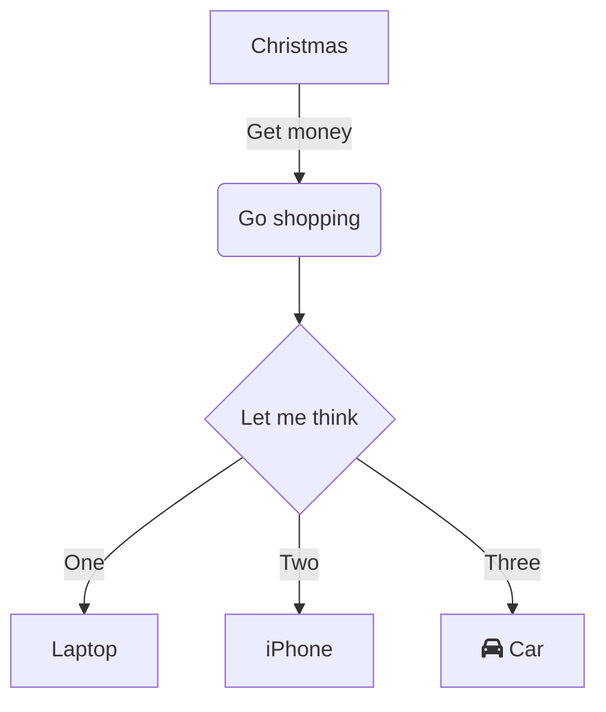

[[Building My Digital Garden]]からの改善記録である。

# Context
- 使用している[ppeetteerrs/obsidian\-zola: A no\-brainer solution to turning your Obsidian PKM into a Zola site\.](https://github.com/ppeetteerrs/obsidian-zola)のthemeでは、モバイルでDigital Gardenを見たときにハンバーガーメニュが検索のみで、セクションが表示されなかったので、PCと同じようにセクションを表示したい
	- ![[Pasted image 20230502212057.png]]

# Steps
## Zolaのtemplatesを調べる
1. 公開されているthemeを検索して似たことをやっている物を調べる
	1. [Themes \| Zola](https://www.getzola.org/themes/)
	- [zhuia/menu\.html at main · gicrisf/zhuia](https://github.com/gicrisf/zhuia/blob/main/templates/macros/menu.html)
		- ページの階層を表示していないので、少しイメージと違う
	- [EasyDocs \| Zola](https://www.getzola.org/themes/zola-easydocs-theme/)  これが良さそう！イメージ通り
		- ![[Pasted image 20230503110748.png]]
2. navigation barで、ハンバーガーメニュ表示とそこに含まれるアイテムを制御できるようにする
	- live reloadを使って、iterationを高速に回す
	- When no hamberger menu,  no toc items
	- SCSSを何とかする
		- `order-0` 
		- cssでhamberger menuを実現している
			- [JavaScript不要！CSSだけでハンバーガーメニューを実装する方法 : ビジネスとIT活用に役立つ情報（株式会社アーティス）](https://www.asobou.co.jp/blog/web/css-menu)
			- 
		- `media-breakpoint-up/down`
			- **CSSの切り替えポイント**のことで、指定したpx数（ピクセル）になると、適用したいCSSを指定することが可能
		- `fork-me`
- 3. toc itemsを階層的に表示する
- 
