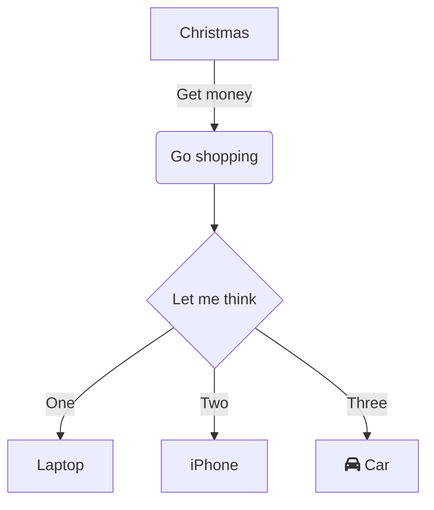

[[Building My Digital Garden]]からの改善記録である。

# Context
- 使用している[ppeetteerrs/obsidian\-zola: A no\-brainer solution to turning your Obsidian PKM into a Zola site\.](https://github.com/ppeetteerrs/obsidian-zola)のthemeでは、モバイルでDigital Gardenを見たときにハンバーガーメニュが検索のみで、セクションが表示されなかったので、PCと同じようにセクションを表示したい
	- ![[Pasted image 20230502212057.png]]

# Steps
## Zolaのtemplatesを調べる
1. 公開されているthemeを検索して似たことをやっている物を調べる
	1. [Themes \| Zola](https://www.getzola.org/themes/)
	- [zhuia/menu\.html at main · gicrisf/zhuia](https://github.com/gicrisf/zhuia/blob/main/templates/macros/menu.html)
		- ページの階層を表示していないので、少しイメージと違う
	- [EasyDocs \| Zola](https://www.getzola.org/themes/zola-easydocs-theme/)  これが良さそう！イメージ通り
		- ![[Pasted image 20230503110748.png]]

